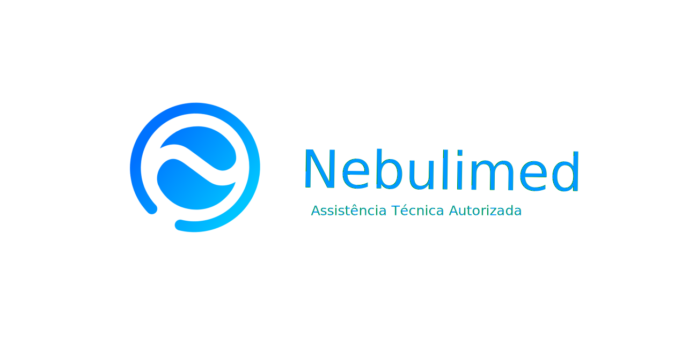
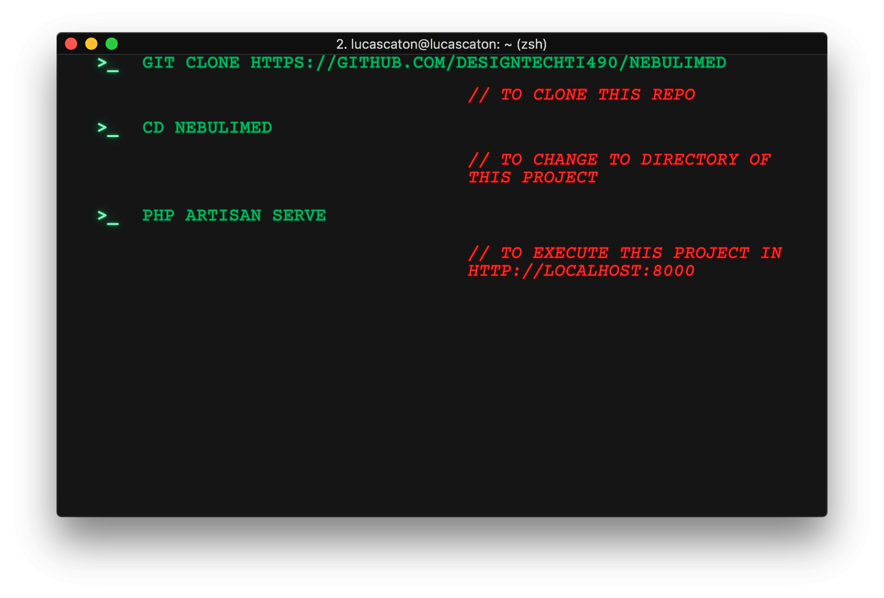

# Nebulimed | Assitência Técnica

## Como executar o projeto

## Sobre o projeto

Novo site da [@nebulimed](https://beacons.ai/nebulimed) está totalmente responsivo (pode ser acessado no celular), com elementos de acessibilidade e UX/UI Design.

Há página de loja virtual, blog com dicas de saúde, empresas autorizadas e formulário de cadastro de clientes.

No Back-end há uma dashboard para que os funcionários internos possam genrenciar ordens de serviços, cadastro de clientes, funcionários, fornecedores, verificar contas à pagar e receber, entre outras informações.

**Contato da Empresa**

&nbsp;
&nbsp;
&nbsp;
&nbsp;
&nbsp;
&nbsp;

## Tecnologias utilizadas

&nbsp;
&nbsp;
&nbsp;
&nbsp;
&nbsp;
